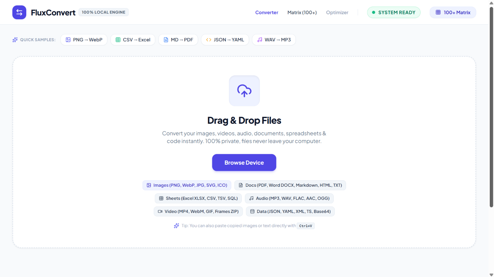
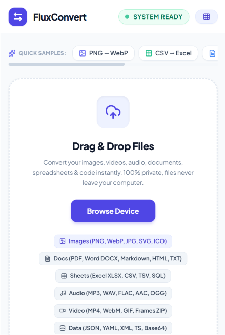

<div align="center">


# FluxConvert

### The ultimate open source file converter that supports up to 100+ file types

Modern, beautiful and free unlimited usage specifically built for any device with browser.  

[](LICENSE)
[]()
[]()

</div>

---

# 📖 About

FluxConvert is a modern free & open source ultimate file converter designed for any devices.

Powered by **FluxConvert Local Engine**, it provides a fast, beautiful and privacy secured through a local session.

Whether you're converting from images, videos or documents, FluxConvert delivers an elegant experience designed specifically for your device. 

---

# ✨ Features

- 🔏 Privacy secured, local session only
- 📂 Supports 100+ File Types
- 🎨 Google Material 3 for Web UI
- 📱 Optimised for phones
- 📟 Optimised for tablets & Windows / macOS / Linux
- 🧹 No history, auto cleanup once exit
- 🌙 Dark Theme
- ☀️ Light Theme
- 🎨 Material You Dynamic Color
- ⚡ Fast and responsive
- 🚫 Zero Ads
- ❤️ Free & Open Source

---

# 📸 Screenshots

<b>Web Version [For any device with web browser (eg. Chrome, Edge, Safari, Samsung Browser etc.)]</b>

<p><p>

<b>Phone Web Version</b>

<p><p>

---

# 📋 Requirements

- Android 10+ / Windows 10+ / macOS 10.13 (High Sierra)+ / Linux
- ARM64 / x64 or x84 device 
- Internet connection (web version)
- Minimum 64 MB RAM recommended

---

# 🚀 Installation (For Windows only)

Download the latest batch script from the Releases page.

Or build from source:

```bash
git clone https://github.com/techambient/HybridAI.git
```

Open the project using Visual Studio Code. 

---

# 🛠️ Built With

- Type Script & Java Script
- Material 3 for Web UI
- Markdown
- HTML (Web version)

---

# 🎨 Design

FluxConvert follows Google's latest Material Design guidelines.

- Material 3 for Web
- Material You
- Dynamic Color
- Edge-to-edge UI
- Adaptive layouts
- Responsive typography

---

# ❤️ Why FluxConvert?

Unlike many converter, FluxConvert focuses on:

- Privacy
- Clean UI
- No ads at all
- Performance
- Open Source
- Modern Web experience
- No unnecessary permissions
- Unlimited free usage

---

# 🤝 Contributing

Contributions are always welcome!

You can help by:

- Reporting bugs
- Suggesting features
- Improving documentation
- Submitting pull requests

---

# ⭐ Support

If you enjoy FluxConvert, please consider giving this repository a ⭐ and give some donations to help keep it alive!

* **Solana (SOL / USDC):** `EME9M9cSy9FvfHvcx2gMPkp1H5Dj4YaKufPRsAyon8Tf`
* **Bitcoin (Taproot):** `bc1pguvpjudf9gr2lyjcf4s9ttvzushgu0hqhr2p7fwqzsz4977kajcqemvned`
* **Bitcoin (Native Segwit):** `bc1qwfjwytw8lehg20es373cx2ulr3el99rt9uurz5`

---

# 📄 License

Licensed under the GPL-v3.

See [LICENSE](LICENSE) for more information.

---

<div align="center">

Made with ❤️ by techambient (Ambient Technologies)

</div>
